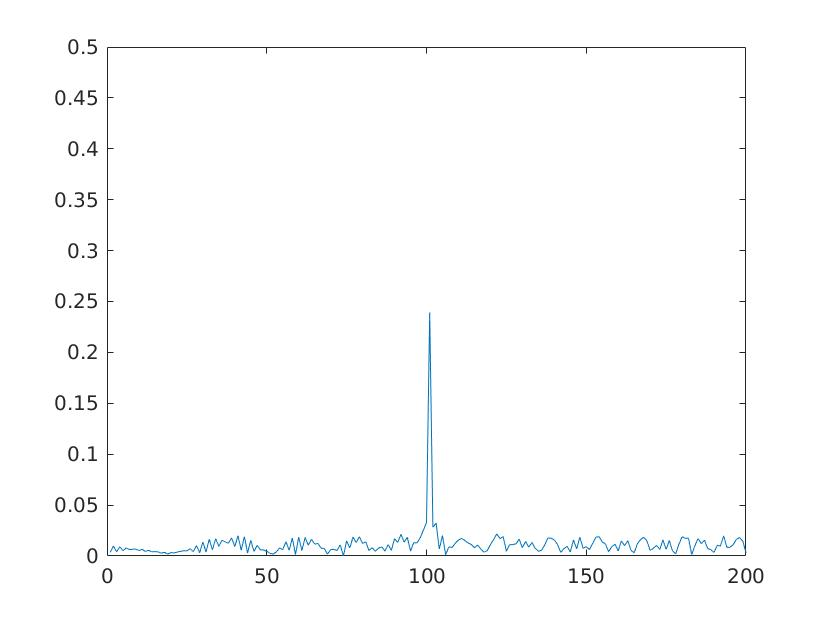

## RADAR TARGET GENERATION & DETECTION
### Radar Specifications
```
Frequency of operation = 77GHz
Max Range = 200m
Range Resolution = 1 m
Max Velocity = 100 m/s
```

### Object Defined Range & Velocity
```
target_range = 100 m
target_velocity = 30 m/s
```

### Generated FMCW Wave Properties
```
Sweep Bandwidth = 0.150 GHz
Chirp Time = 7.3333E-6 s
Number of chirps in one sequence = 128
Number of samples in each chirp = 1024
```

### Range Estimation Using FFT


### Range & Velocity Estimation Using FFT_2D & CIFAR
```
Range Train Cells = 15
Range Guard Cells = 4
Doppler Train Cells = 10
Doppler Guard Cells = 4
Offset = 7
```
Process:
- Apply FFT 2D on Mixed Signal to obtain a Range-and-Doppler Matrix (Mixed Signal was calculated by taking the inner product of Tx & Rx wave)
- Slide through Cell-Under-Test (CUT) cell across the matrix:
    + Convert training cells from Decibel to Power
    + Calculate the noise level by averaging a neighbor training cell section
    + Convert noise level back to Decibel and add Offset
    + If CUT cell > noise_level then CUT = 1 else CUT = 0 


